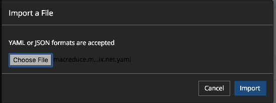

#API Connect Hands-On Labs

##Exercise 3: Design your OpenAPI Swagger specification

### Prerequisites

Make sure you've met the following prerequisites.

**Prerequisite 1**: Installed the Hands-On Labs locally. You can either `git clone` [https://github.com/ragsns/apichol] (https://github.com/ragsns/apichol) or download a zip from the repository.

### Ensure that you are in the right sub-directory

Ensure that you are in sub-directory ex3.

```
cd <path-to-hol-folder>/apichol/exercises/ex3
```

### Goals

For this exercise, we'll:

1. Learn about the OpenAPI Specification (Swagger Specification) 2.0 and its components
2. Learn how to use Swagger Editor to design and modify an existing Swagger JSON specification of an API

### [OpenAPI](https://github.com/OAI/OpenAPI-Specification) (Current Version: 2.0)
The Open API Specification (formerly known as the Swagger specification) is the industry standard for defining REST APIs.  The goal of The OpenAPI Specification is to define a standard, language-agnostic interface to REST APIs which allows both humans and computers to discover and understand the capabilities of the service without access to source code, documentation, or through network traffic inspection. When properly defined via OpenAPI, a consumer can understand and interact with the remote service with a minimal amount of implementation logic.

<blockquote><b style="color:maroon">OpenAPI removes the guesswork in calling the service</b></blockquote>

#### [OpenAPI Components](https://github.com/OAI/OpenAPI-Specification/blob/master/versions/2.0.md)

- FORMAT:  The files describing the RESTful API in accordance with the Swagger specification are represented as **JSON objects** and conform to the JSON standards. YAML, being a superset of JSON, can be used as well to represent a Swagger specification file.
- BENEFITS:  With a OpenAPI specifcation, you'll be able to generate client libraries in lots of runtime languages, generate server stubs, import these definitions into API management tools such as Bluemix APIConnect and use tools to verify conformance. 

### [Swagger Editor](http://editor.swagger.io/#/)
Swagger Editor is a handy open source web application that lets you quickly edit OpenAPI Swagger specifications in YAML or JSON.  You can import or create custom specifications within a browser.  We'll use this hosted editor and a Swagger JSON specification **macreduce.mybluemix.net.json** located within the ex3 sub-directory to illustrate the use of the editor and how it can be used to design/modify a Swagger specification.

#### Exploring an OpenAPI (Swagger) 2.0 Specification

1.  Browse to [Swagger Editor](http://editor.swagger.io/#/) and click on the File menu choice **Import File...** .  You will select the macreduce.mybluemix.net.yaml file found within your ex3 sub-directory.
    <br/><br/>
    

    

2.  After import, you should see a split pane view with the raw text Swagger spec on the left and a rendered view on the right.
    <br/>
    

3.  We will now make a modification to the existing swagger specification.  Browse to the section of the spec that looks similiar to:
<pre>
  '/mac/{macId}':
      get:
        summary: Retrieves a Mac document
        responses:
          '200':
            description: Mac document fetched successfully
        parameters:
          - in: path
            name: macId
[...]
</pre>
We will add an expected response to document the API's behavior when attempting to fetch a non-existent macId resource.  Add two lines just above the parameters section so that it now looks like this:
<pre>
  '/mac/{macId}':
      get:
        summary: Retrieves a Mac document
        responses:
          '200':
            description: Mac document fetched successfully
          '404':
            description: Mac document not found
        parameters:
          - in: path
            name: macId
[...]
</pre>
  The specification provides a wide variety of data elements to facilitate describing your API set.  As you inspect your OpenAPI specification file, some important elements to consider include: 

  -  method types (get, post, delete, ...)
  -  responses (200, 400, 404, ...)
  -  parameters
  -  paths
  -  content-types (application/json, application/xml, ...)

4.  Click on the File menu choice **Download JSON** to obtain a local copy of your newly modified OpenAPI Swagger 2.0 specification.
    <br/><br/>
    

5.  As you can see, Swagger Editor is a great tool for modifying existing OpenAPI specifications and/or creating brand new specifications.

Next, we'll create a Loopback Application and pull in these APIs.
