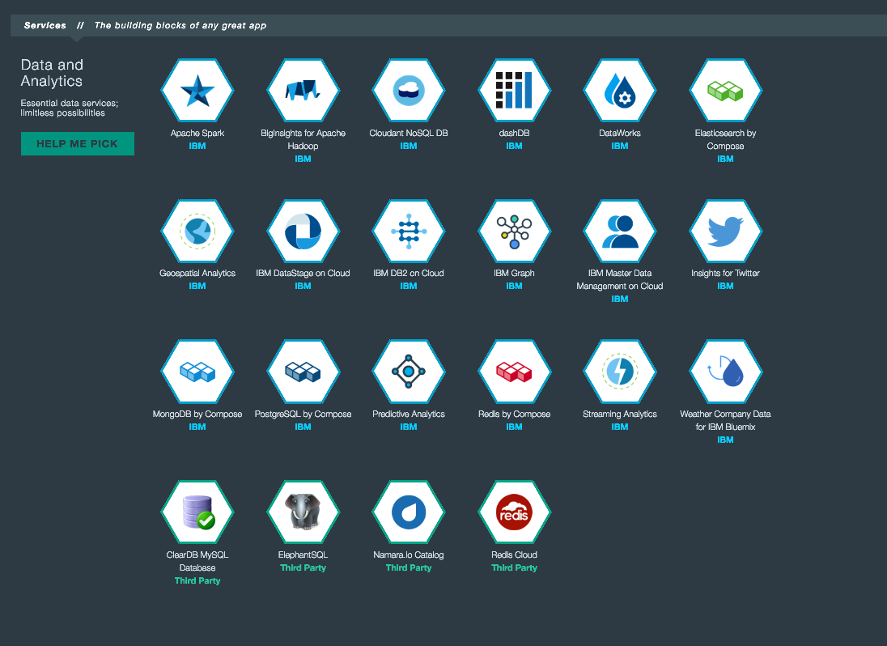

#API Connect Hands-On Labs

##Exercise 5: Create a database service on Bluemix

### Prerequisites

Make sure you've met the following prerequisites.

**Prerequisite 1**: Registered for a Bluemix account that is **still current** (trial Bluemix accounts are available at <http://console.ng.bluemix.net>). Contact the instructor for a promotion code for a bump in the quota. Please note down the `username` (or `email`) and `password` which will be used to login via the `cf` CLI.

**Prerequisite 2**: Installed the Cloud Foundry CLI from <https://github.com/cloudfoundry/cli#downloads>.

**Prerequisite 3**: Installed `npm` and `apic`. Refer to instructions from [https://nodejs.org/en/download/] (https://nodejs.org/en/download/) and [https://www.npmjs.com/package/apiconnect] (https://www.npmjs.com/package/apiconnect) respectively.

**Prerequisite 4**: Installed the Hands-On Labs locally. You can either `git clone` [https://github.com/ragsns/apichol] (https://github.com/ragsns/apichol) or download a zip from the repository.

### Ensure that you are in the right sub-directory

Ensure that you are in sub-directory ex5.

```
cd <path-to-hol-folder>/apichol/exercises/ex5
```

### Verify your Target within Bluemix instance

Verify your Target within Bluemix Cloud Foundry instance by issuing the following command. 

```
cf target
```

The output for the `cf` CLI should look something like below.

```

API endpoint:   https://api.ng.bluemix.net (API version: 2.54.0)
User:           <bluemix_email_id>
Org:            <bluemix_email_id>
Space:          dev
 
```

### Creating a database service
IBM Bluemix offers a wide array of data service options that are just a few clicks/commands away.



For this exercise, we'll be instantiating a MySQL database service maintained by the community and offered as a part of the base Cloud Foundry platform.  MySQL is an open-source relational database management system (RDBMS).

Creating a Bluemix service instantiation requires input of three fields:

- Name of the service offering
- Plan of the service offering
- Instance name of your instantiated service

**Name of the service offering**:<br/>
Defined by the service provider when registering their service with Bluemix.

**Plan of the service offering**:<br/>
Defined by the service provider based on varying levels of quality of service (QoS), resource throttling and price.

**Instance name**:<br/>
Defined by the user.  This will be the canonical name that uniquely identifies this service instantiation.  It is typically used when defining service dependencies within application manifests or Bluemix CLI operations such as service binding.

####Identifying the name and plan of a service offering

Cloud Foundry offers a listing of the entire service marketplace registered within the platform.  Beware, this can be a **lengthy query** (~2-5 mins) proportional to the size of the platform catalog. For the curious, the command is:   

```
cf marketplace
```

The output for the `cf` CLI would look something like below.

```
Getting services from marketplace in org xxx@xxx.xxx / space dev as xxx@xxx.xxx ...
OK

service                                          plans                                                                         description
APIConnect                                       Essentials, Professional*, Enterprise*, Professional 5M*, Enterprise 25M*     Create, manage, enforce, and run APIs.
AdvancedMobileAccess                             Gold*, Bronze*                                                                Finely tune mobile apps with operational analytics, and ensure communications with back end systems are secure.
Application Security on Cloud                    free, standard*                                                               A robust, practical security vulnerability assessment for your web applications.
Auto-Scaling                                     free                                                                          Automatically increase or decrease the number of application instances based on a policy you define.

[....] 
```
As you can see, the first two columns contain 2 out of 3 of parameters that we need.  In particular, there are two MySQL services of interest to us:

- **Cleardb**
- **MySQL** 

While the marketplace command contains both names and plans, there may be times where you know the name of the service and simply want to enumerate the latest plan options.  If so, there is a convenient shortcut CLI command to discover only the associated plans.<br/>
**Nota Bene:  This convenience does not extend to services designated as experimental within the catalog**

For example, the command to discover the Cleardb plans are:

```
cf marketplace -s cleardb
```


The output for the `cf` CLI should look something like below.

```
Getting service plan information for service cleardb as xxx@xxx.xxx...
OK

service plan   description                                                                     free or paid
spark          Great for getting started and developing your apps                              free
boost          Best for light production or staging your applications                          paid
shock          Designed for apps where you need real MySQL reliability, power and throughput   paid
amp            For apps with moderate data requirements                                        paid
```

Based on the above commands, we can now discern the key details for both MySQL service providers:

|  Service Provider 	| Service Name 	| Service Plan (Free) 	|
|:-----------------:	|:------------:	|:-------------------:	|
|      ClearDB      	|    cleardb   	|        spark        	|
| MySQL (Community) 	|     mysql    	|         100         	|

We are now ready to create our MySQL service instance by issuing either of the following commands: 

```
cf create-service cleardb spark workshopmysql
```

**OR**

```
cf create-service mysql 100 workshopmysql
```

The output for the `cf` CLI should look something like below.

```
Creating service instance workshopmysql in org xxx@xxx.xxx / space dev as xxx@xxx.xxx...
OK
``` 

Congratulations, you now have a MySQL service instance exclusively for your application and API development needs.  At this point, you may be wondering about discovery of connection information to access this service.  We need to create a service key credential set for our newly minted MySQL service. We can do this by issuing the following command:

```
cf create-service-key workshopmysql connectioncreds
```

The output for the `cf` CLI should look something like below.

```
Creating service key connectioncreds for service instance workshopmysql as xxx@xxx.xxx...
OK
``` 

Finally, we can examine the generated credentials by executing the following command:

```
cf service-key workshopmysql connectioncreds
```

The output for the `cf` CLI should look something like below.

```
{
 "host": "192.168.255.255",
 "hostname": "192.168.255.255",
 "name": "dc9caxxxxxxxxxxxxxxxxxxe4ec",
 "password": "p9c#&$^&*@TN",
 "port": 3307,
 "uri": "mysql://uevWFw0FThyL9:p9c#&$^&*@TN@192.168.255.255:3307/dc9caxxxxxxxxxxxxxxxxxxe4ec",
 "user": "uevWFw0FThyL9",
 "username": "uevWFw0FThyL9"
}
```
Armed with this connection information, we are now able to interact with our new MySQL server.
 
In the next exercise, we will dive into creation of database CRUD APIs.
